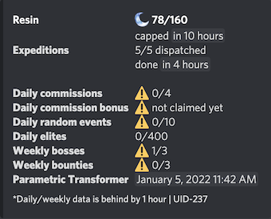
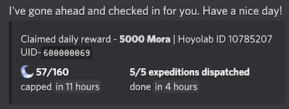
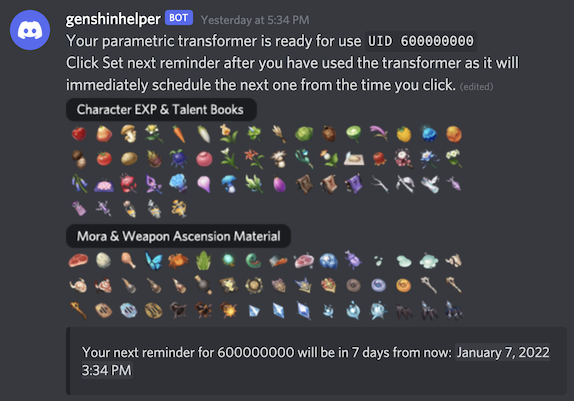
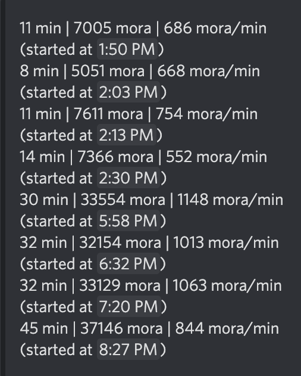
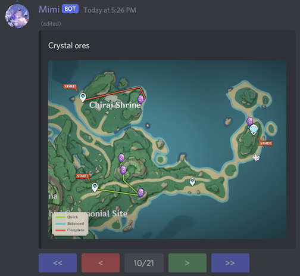

# GenshinHelper


[](https://discord.gg/Hay8zp5xfv)

A Discord bot to help with your daily Genshin tasks.

Feel free to join the Discord server if you would like more immediate assistance, but please file an issue first if it's a bug/feature request.

[](https://heroku.com/deploy)

## Key Features

- Auto-checkin Hoyolab for daily rewards
- Notify when resin reaches cap
- Notify when parametric transformer is ready
- Quick glance at daily/weekly tasks like commissions and bounties
- View real-time resin and expedition info
- View daily elite cap and recent runs
- Auto-redeem Genshin codes for everyone
- Export game data

## Bot usage

To register your Genshin account with the bot, go to hoyolab.com and log in your account.
Then press F12 (Chrome Inspect Mode) and go to Application > Cookies > https://www.hoyolab.com.

Copy ltuid, ltoken and cookie_token and paste them in the `/user register` command.

### Examples

`/resin` keeps you on top of the daily activities you need to do in game.



Auto-checkin can be enabled in `/user settings` to get daily rewards from Hoyolab.



Get reminder for when your parametric transformer is off cooldown.



Check how fast your elite runs went.



Look up a route for any resource, allowing you to sync up with your friends on Discord
with a paginated route display.



## Installation

This bot is written with simplicity in mind so that it can be deployed to a tiny computer
like the $15 Raspberry Pi Zero.

- Install Python 3.9+
- Create a virtual env and run `pip install -r requirements.txt`
- Optionally you can also install other requirement files, but they are not needed for the core features.
- Create an `.env` file from the `.env.default` and fill in `BOT_TOKEN`.
- Run main.py or set up a systemd service using the example below

`sudo vim /etc/systemd/system/genshinhelper.service`
```
[Unit]
Description=genshinhelper
After=network.target

[Service]
EnvironmentFile=/home/pi/apps/genshinhelper/.env
ExecStart=/home/pi/.virtualenvs/genshinhelper/bin/python3 /home/pi/apps/genshinhelper/src/main.py
WorkingDirectory=/home/pi/apps/output
Restart=always
RestartSec=30
User=pi

[Install]
WantedBy=multi-user.target
```

Start: `sudo systemctl start genshinhelper`

Read logs: `journalctl -u genshinhelper -f`
